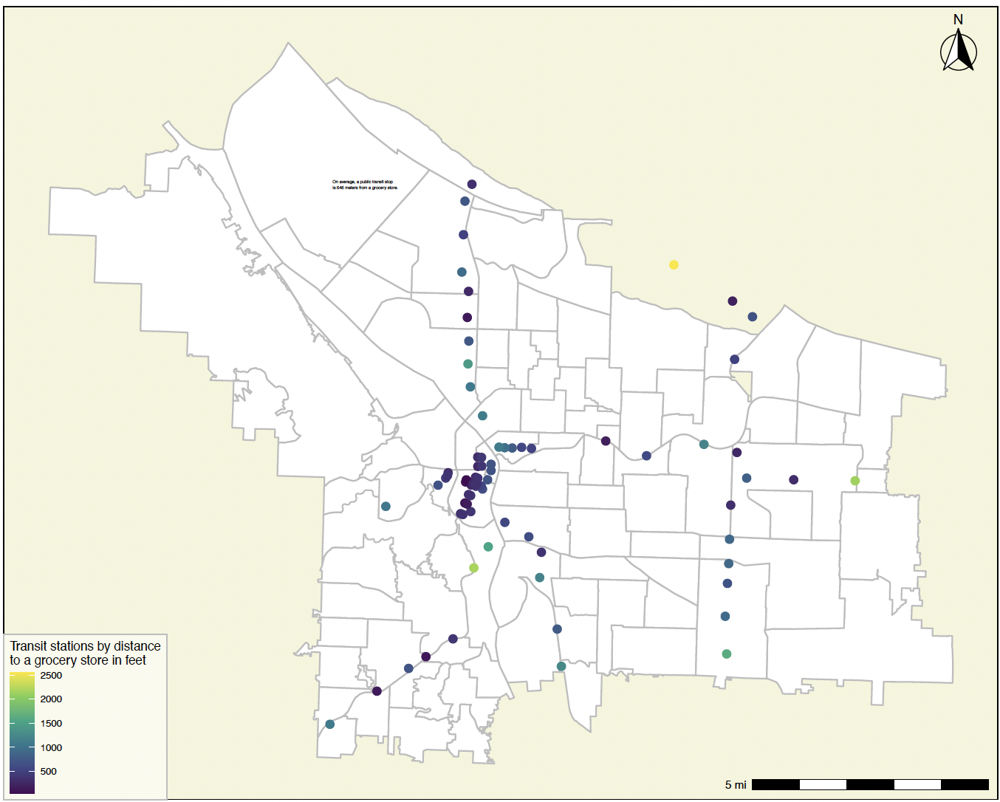

```{r setup, include=FALSE}
knitr::opts_chunk$set(echo = TRUE)
```

# Introduction

This is my final portfolio for VIS 2128, and displays a few of the maps I've made for the previous assignments. 

Before this class, I had never worked with any sort of computer coding, much less any code used to create detailed and analytical maps. I am incredibly grateful for the skills I have gained, and hope these maps adequately show my progress throughout the module. 


* Displaying multiple vector layers on the same map
* Calculating and displaying relationships among point and polygon layers based on distance
* Aggregating point data to a layer of polygons
* Calculating and displaying accessibility, based on travel time
* Converting between raster layers and vector layers
* Displaying raster data on a map
* Georeferencing a raster image
* Displaying data on an interactive map

# Interactive Map

This is a map which displays the average income per census tract in Cook County, Illinois (where Chicago is located), according to the 2019 American Community Survey. I grew up in Chicago, and the issue of racial and class-based segregation permeated much of the contemporary discourse about urban life. This map makes shows the stark differences in income across the county, and especially between the central city and the wealthier suburbs. 
 
 This map demonstrates the following skills: 

* Displaying data on an interactive map

[](https://mzajakowskiuhll.github.io/FinalPortfolio/fullsize/Income_Cook_Map.html){target="_blank"}

# Portland Maps

For Assignment 3, my group and I decided to do an analysis of foodscapes in Portland, and the accessibility of grocery stores for public transit. Both of these maps were created with the help of those teammates, Daniel Montoya and Wladka Kijewska.

## Portland Map 1

This map shows the spatial relationship between grocery stores and "required residential developments" in Portland, which are essentially parts of the city zoned off for low income residential development initiatives. 

This map demonstrates the following skills:

* Aggregating point data to a layer of polygons
* Displaying multiple vector layers on the same map
* Calculating and displaying relationships among point and polygon layers based on distance

[](https://mzajakowskiuhll.github.io/FinalPortfolio/fullsize/PortlandGrocerytransit.pdf){target="_blank"}

## Portland Map 2

This map shows the average distance between light rail stops and grocery stores in Portland. 

This map demonstrates the following skills:

* Aggregating point data to a layer of polygons
* Displaying multiple vector layers on the same map
* Calculating and displaying relationships among point and polygon layers based on distance

[](https://mzajakowskiuhll.github.io/FinalPortfolio/fullsize/PortlandGroceryTrain.pdf){target="_blank"}

# Boston Maps

##Boston Map 1

I completed this map for Assignment 4. Since moving to Boston, I have wanted to learn more about the city - using it as an example for several of my assignments has proved an excellent approach. 

This map shows isochrones based on car travel times to the nearest police station throughout the city of Boston. 

This map demonstrates the following skills:

* Displaying multiple vector layers on the same map
* Calculating and displaying accessibility, based on travel time

[](https://mzajakowskiuhll.github.io/FinalPortfolio/fullsize/PoliceStationIsochrones.pdf)){target="_blank"}

##Boston Map 2

[![]

#Historic Detroit Map

This map was originally scanned from the Maps Library for Assignment 2, and then geo-referenced using ARC GIS. It is a 1934 population density map of Detroit. The yellow circles represent the density of vacant lots registered with the city in 2020: I thought the two data sets told a striking story about Detroit's population decline in the last half-century. 

This map demonstrates the following skils: 

* Displaying raster data on a map
* Georeferencing a raster image

[](){target="_blank"}
