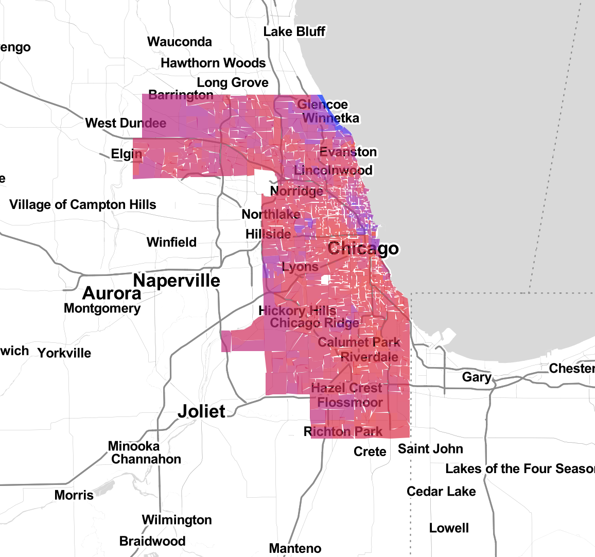
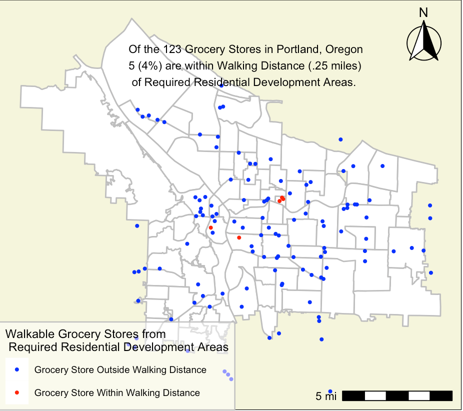
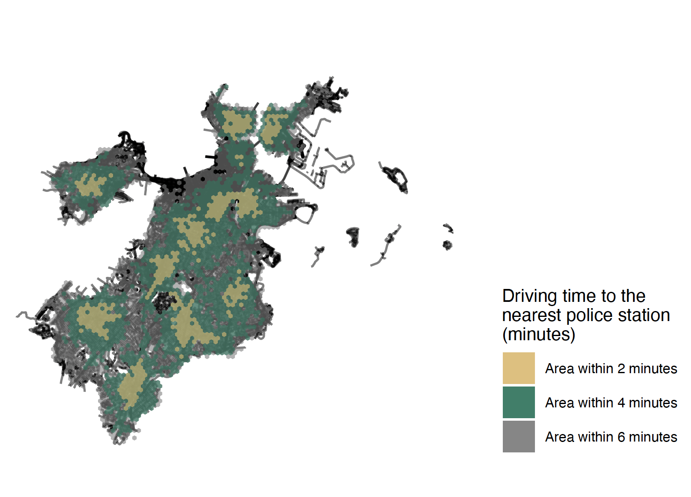
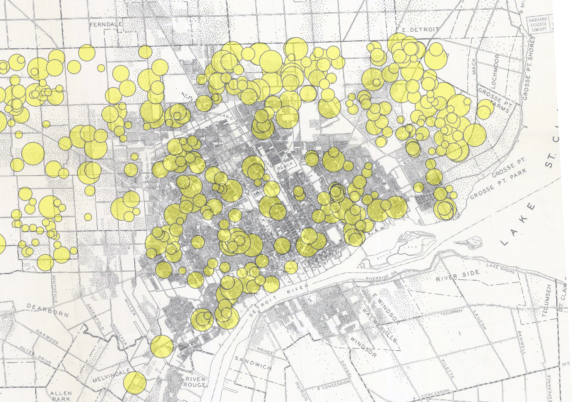

```{r setup, include=FALSE}
knitr::opts_chunk$set(echo = TRUE)
```

# Introduction

This is my final portfolio for VIS 2128, and displays a few of the maps I've made for the previous assignments. 

Before this class, I had never worked with any sort of computer coding, much less any code used to create detailed and analytical maps. I am incredibly grateful for the skills I have gained, and hope these maps adequately show my progress throughout the module. 


* Displaying multiple vector layers on the same map
* Calculating and displaying relationships among point and polygon layers based on distance
* Aggregating point data to a layer of polygons
* Calculating and displaying accessibility, based on travel time
* Converting between raster layers and vector layers
* Displaying raster data on a map
* Georeferencing a raster image
* Displaying data on an interactive map

# Interactive Map

This interactive map demonstrates the following skills: 

* Displaying data on an interactive map

[](https://https://github.com/mzajakowskiuhll/FinalPortfolio/blob/main/fullsize/Income_Cook_Map.html){target="_blank"}

# Portland Map
This map demonstrates the following skills:

* Aggregating point data to a layer of polygons

[](https://https://github.com/mzajakowskiuhll/FinalPortfolio/blob/main/fullsize/PortlandGrocerytransit.pdf){target="_blank"}


# Boston Isochrones
This map shows isochrones based on car travel times to the nearest police station. It demonstrates the following skills:

* Displaying multiple vector layers on the same map
* Calculating and displaying accessibility, based on travel time

[](https://github.com/mzajakowskiuhll/FinalPortfolio/blob/main/fullsize/PoliceStationIsochrones.pdf){target="_blank"}

#Historic Detroit Map
This map shows accessibility based on a distance-decay function of the walking time to the nearest transit stop. It demonstrates the following skills:

* Displaying multiple vector layers on the same map
* Calculating and displaying accessibility, based on travel time
* Displaying raster data on a map

[](){target="_blank"}
